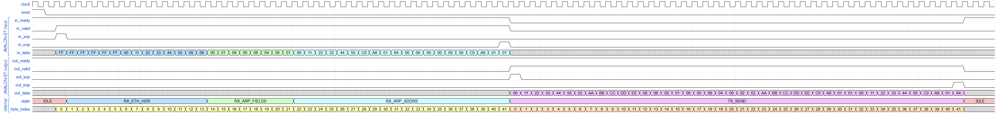
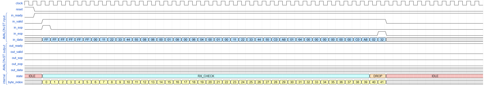
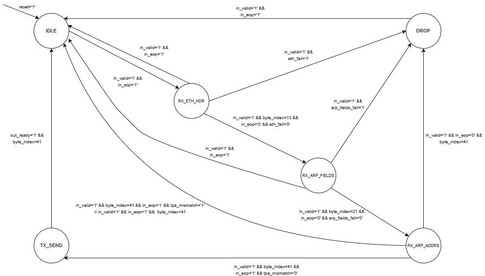

# ARP Responder

## Uvod

U Ethernet mrežama, isporuka okvira na podatkovnom sloju zasniva se isključivo na fizičkim (MAC) adresama, dok se na mrežnom sloju komunikacija odvija pomoću logičkih IPv4 adresa. Ova razlika u adresiranju zahtijeva mehanizam koji omogućava preslikavanje IPv4 adresa u odgovarajuće MAC adrese unutar lokalne mreže. Upravo tu ulogu ima Address Resolution Protocol (ARP), koji predstavlja osnovni, ali neophodan dio svake IPv4 Ethernet mreže [1].

Cilj ovog projekta je implementacija ARP Responder modula u VHDL-u, koji prima Ethernet okvire putem Avalon-ST interfejsa i generiše ARP Reply poruke za unaprijed definisanu IPv4 adresu lokalnog čvora. Projekat se fokusira na ispravnu interpretaciju ARP protokola, pravilno rukovanje streaming interfejsom (ready/valid), te precizno formiranje odgovora u skladu sa relevantnim standardima.

## Address Resolution Protocol (ARP)

ARP (Address Resolution Protocol) je protokol koji povezuje logičko adresiranje na mrežnom sloju (IPv4 adrese) sa fizičkim adresiranjem na podatkovnom sloju (MAC adrese) u lokalnoj mreži. U tipičnoj Ethernet LAN mreži, Ethernet okvir se isporučuje na osnovu MAC adrese odredišta, dok aplikacije i protokoli viših slojeva (npr. TCP/UDP) komuniciraju korištenjem IP adresa.

Kada čvor želi poslati IP paket ka određenoj IPv4 adresi u istoj lokalnoj mreži, on mora znati kojoj MAC adresi ta IP adresa pripada. Ako tražena IP adresa nije prisutna u lokalnoj ARP tabeli (ARP cache), čvor inicira ARP postupak razrješenja adrese (engl. *address resolution*):

1. Generiše se ARP Request – broadcast Ethernet okvir u kojem se navodi:
   - IP adresa čvora čija se MAC adresa traži,
   - IP i MAC adresa pošiljaoca zahtjeva.
2. Svi uređaji u lokalnoj mreži primaju ARP Request, ali **odgovara samo onaj čija IP adresa odgovara traženoj adresi**.
3. Taj uređaj šalje ARP Reply – unicast Ethernet okvir koji sadrži:
   - svoju MAC adresu,
   - svoju IP adresu,
   - IP/MAC adrese pošiljaoca zahtjeva u odgovarajućim poljima.
4. Pošiljalac ažurira svoju ARP tabelu, upisuje par (IP, MAC) i omogućava slanje IP paketa ka tom odredištu koristeći dobijenu MAC adresu [1].

Na narednoj slici prikazan je proces ARP komunikacije, uključujući ARP request i ARP reply:

 
  <em> Slika 1. Proces ARP komunikacije kroz request i reply poruke [6]</em>

## ARP poruka i struktura ARP paketa

ARP poruka se ne prenosi samostalno, već je enkapsulirana unutar Ethernet okvira. Dužina Ethernet zaglavlja je 14 bajtova, dok je dužina ARP zaglavlja 28 bajtova. Informacije vezane za Address Resolution Protocol nalaze se upravo u ovom dijelu.
U ARP paketu, EtherType u Ethernet zaglavlju ima vrijednost `0x0806` [3]. Ostali dijelovi Ethernet zaglavlja isti su kao i kod drugih Ethernet paketa.
Struktura ARP zaglavlja prikazana je na Slici 2 i sastoji se od sljedećih polja:

  
  <em> Slika 2. Dijelovi ARP headera [3]</em>

- **Hardware type (HTYPE)** – tip fizičkog interfejsa; za Ethernet je najčešće vrijednost `1`.
- **Protocol type (PTYPE)** – identifikator protokola višeg sloja; za IPv4 se koristi vrijednost `0x0800`.
- **Hardware address length (HLEN)** – dužina hardverske (MAC) adrese u oktetima; za Ethernet je `6`.
- **Protocol address length (PLEN)** – dužina IP adrese u oktetima; za IPv4 je `4`.
- **Opcode ili Operation code (OPER)** – tip ARP poruke:
  - `1` – ARP Request,
  - `2` – ARP Reply.
- **Sender hardware address (SHA)** – MAC adresa pošiljaoca ARP poruke.
- **Sender protocol address (SPA)** – IP adresa pošiljaoca ARP poruke.
- **Target hardware address (THA)** – MAC adresa odredišta (kod ARP Requesta se često stavlja nula, jer još nije poznata).
- **Target protocol address (TPA)** – IP adresa odredišta čija se MAC adresa traži [3].

Kombinacijom ovih polja, ARP omogućava da čvor jednoznačno identifikuje ko traži adresu (sender) i za koju IP adresu (target) želi da dobije MAC adresu. Višebajtna polja u ARP zaglavlju kodirana su u mrežnom poretku bajtova (engl. *network byte order*), odnosno s najznačajnijim bajtom prvim. Ova činjenica je od posebnog značaja za hardversku implementaciju protokola, gdje se obrada ARP poruke vrši bajt-po-bajt putem streaming interfejsa.

## Opis projekta i popis signala

U ovom projektu implementira se VHDL modul ARP Responder, čija je uloga da odgovori na ARP upite za rezoluciju MAC adrese lokalnog čvora. Modul prima Ethernet/ARP okvire putem Avalon-ST interfejsa i generiše odgovarajući ARP reply kada je ciljna IP adresa jednaka adresi konfigurisanog čvora.
IP adresa i MAC adresa uređaja definišu se kao generički parametri prilikom instanciranja modula. Komunikacija preko ulaznih i izlaznih portova odvija se korištenjem ready/valid rukovanja, koje obezbjeđuje pouzdan prijenos podataka kroz tok.
U nastavku je prikazan popis svih signala korištenih u ARP Responder modulu (Avalon-ST streaming interfejs).

| IN/OUT | Tip | Signal | Opis |
|---|---|---|---|
| IN | `STD_LOGIC` | `clock` | Takt signal koji sinhronizira sekvencijalnu logiku modula. |
| IN | `STD_LOGIC` | `reset` | Reset signal (aktivna visoka vrijednost); vraća FSM i interne registre u početno stanje. |
| IN | `STD_LOGIC_VECTOR(7 downto 0)` | `in_data` | Ulazni podaci (bajt-po-bajt) – dolazni Ethernet/ARP okvir. |
| IN | `STD_LOGIC` | `in_valid` | Označava da je `in_data` važeći u trenutnom taktu. |
| IN | `STD_LOGIC` | `in_sop` | Start of Packet (ulaz) – aktivan na prvom bajtu paketa. |
| IN | `STD_LOGIC` | `in_eop` | End of Packet (ulaz) – aktivan na posljednjem bajtu paketa. |
| OUT | `STD_LOGIC` | `in_ready` | Modul spreman za prijem; prijem bajta se dešava kada su `in_valid=1` i `in_ready=1`. |
| OUT | `STD_LOGIC_VECTOR(7 downto 0)` | `out_data` | Izlazni podaci (bajt-po-bajt) – generisani ARP Reply okvir. |
| OUT | `STD_LOGIC` | `out_valid` | Označava da je `out_data` važeći u trenutnom taktu. |
| OUT | `STD_LOGIC` | `out_sop` | Start of Packet (izlaz) – aktivan na prvom bajtu ARP Reply paketa. |
| OUT | `STD_LOGIC` | `out_eop` | End of Packet (izlaz) – aktivan na posljednjem bajtu ARP Reply paketa. |
| IN | `STD_LOGIC` | `out_ready` | Primalac spreman; slanje bajta se dešava kada su `out_valid=1` i `out_ready=1`. |

## Scenariji za testiranje

Validacija ARP Responder modula izvršena je kroz dva ključna scenarija koji pokrivaju ispravno procesiranje, filtriranje saobraćaja i ignorisanje nepodržanih protokola.

### **1. Generisanje ARP odgovora (Target IP Match)**
Ovo je osnovni scenarij u kojem čvor prima ARP zahtjev koji je namijenjen upravo njemu.

* **Mrežni događaj:** Čvor *ARP resolver* šalje broadcast **ARP Request** (`EtherType = 0x0806`, `Opcode = 0x0001`) sa traženom ciljnom IP adresom (`TPA`).
* **Obrada:** Svi čvorovi u broadcast domeni prime zahtjev, ali **odgovara samo** čvor čija IP adresa odgovara `TPA`.
* **Rezultat:** Ciljni čvor šalje **ARP Reply** (unicast, `Opcode = 0x0002`) prema pošiljaocu zahtjeva, pri čemu u polju `SHA` navodi svoju MAC adresu. Pošiljalac zatim ažurira ARP tabelu i može slati IP pakete koristeći dobijenu MAC adresu.

   
  <em>Slika 3: UML sekvencijalni dijagram – validna ARP rezolucija</em>

### **2. Filtriranje tuđih zahtjeva i nevažećeg saobraćaja (Target IP Mismatch)**

Ovaj scenarij prikazuje situacije u kojima posmatrani čvor ne smije poslati ARP odgovor.

* **Slučajevi bez odgovora:**
  - **Non-ARP okvir:** `EtherType ≠ 0x0806` (npr. IPv4 okvir gdje je `EtherType = 0x0800`).
  - **Nevažeća ARP poruka:** ARP okvir koji nema ispravne parametre zaglavlja ili nije ARP Request, npr. važi bilo koji od uslova:  
    `HTYPE ≠ 0x0001` **ili** `PTYPE ≠ 0x0800` **ili** `HLEN ≠ 6` **ili** `PLEN ≠ 4` **ili** `Opcode ≠ 0x0001`.
  - **Target IP mismatch:** ARP Request je formalno ispravan, ali ciljni IP (`TPA`) **ne pripada** posmatranom čvoru.
* **Rezultat:** Posmatrani čvor ignoriše okvir i **ne šalje** ARP Reply.

   
  <em>Slika 4: UML sekvencijalni dijagram – Filtriranje tuđih zahtjeva i nevažećeg saobraćaja (Target IP Mismatch) </em>

## WaveDrom dijagram
Wavedrom dijagrami su kreirani pomoću WaveDrom alata. Izvorni `.json` fajlovi za sve prikazane scenarije dostupni su u direktoriju [Wavedrom](./Wavedrom).

Dijagrami pokrivaju sljedeće scenarije:

### Scenario 1: Generisanje ARP odgovora (Target IP Match)

Ovaj scenarij demonstrira nominalni rad ARP Responder modula kada primi ARP Request paket namijenjen upravo njemu. Prikazani dijagram prikazuje kompletan ciklus: od detekcije broadcast zahtjeva do generisanja unicast odgovora.

   
  <em>Slika 5: Wavedrom za uspješnu rezoluciju </em>

* **1. Ulazna faza: Prijem i Identifikacija (RX)**
Proces počinje aktivacijom Avalon-ST Input interfejsa (`in_valid = 1`, `in_sop = 1`). Modul analizira dolazni okvir:
Ethernet Zaglavlje: Detektuje se Broadcast MAC (`FF..FF`), što signalizira da je paket namijenjen svima. `EtherType 0806` potvrđuje da je riječ o `ARP protokolu`.
ARP Zaglavlje: `Opcode 00 01` identifikuje ARP Request. Modul privremeno pamti Sender MAC i Sender IP (`192.168.1.100`) kako bi adresirao odgovor.
* **2. Proces**
Automat stanja prolazi kroz sekvencu provjere zaglavlja do stanja `RX_ARP_ADDRS`, gdje se donosi odluka:
Poređenje: Modul čita Target IP (`192.168.1.1`) iz paketa i poredi ga sa svojom lokalnom IP adresom.
Odluka: Budući da je detektovano poklapanje adresa, automat prelazi u stanje `TX_SEND` radi slanja odgovora.
* **3. Izlazna faza: Generisanje Odgovora (TX)**
U stanju `TX_SEND`, modul putem Avalon-ST Output linija generiše odgovor:
Ethernet Odgovor: Paket se šalje kao Unicast. Destination MAC se postavlja na adresu pošiljaoca zahtjeva (`00:11:22...`), a Source MAC na adresu FPGA modula.
ARP Payload: Opcode se mijenja u `00 02` (ARP Reply). U polje Sender IP upisuje se lokalna adresa (`192.168.1.1`), dok se originalni pošiljalac postavlja kao Target.
Kraj: Signal `out_eop` označava kraj prenosa, nakon čega se FSM vraća u IDLE.

### Scenario 2: Odbacivanje tuđeg zahtjeva (Target IP Mismatch)

Dijagram prikazuje ponašanje modula kada primi ARP zahtjev koji nije namijenjen ovom uređaju (nepoklapanje IP adrese).

   
  <em>Slika 6: Wavedrom za neuspješnu rezoluciju </em>

* **1. Ulazna faza: Prijem Paketa (RX)**
Modul putem Avalon-ST Input interfejsa uredno prima Broadcast ARP paket.
Automat stanja prolazi kroz standardne faze provjere (`RX_ETH_HDR, RX_ARP_FIELDS`) jer je struktura paketa validna.
Paket se identifikuje kao ARP Request sa pitanjem: "Ko ima IP adresu `192.168.2.50`?"
* **2. Logika Odlučivanja (Mismatch)**
U stanju RX_ARP_ADDRS, vrši se ključna provjera:
Poređenje: Modul čita traženi Target IP (`192.168.2.50`) i poredi ga sa svojom lokalnom IP adresom (`192.168.1.1`).
Detekcija: Logika detektuje da se adrese ne podudaraju. Zahtjev nije namijenjen ovom uređaju.
* **3. Ishod: Odbacivanje (DROP)**
Umjesto prelaska u fazu slanja, dešava se sljedeće:
Stanje: Automat prelazi u stanje `DROP` kako bi prekinuo obradu, a zatim se odmah vraća u `IDLE`.
Izlaz: Avalon-ST Output signali (`out_valid`, `out_sop`) ostaju na nuli. Modul ostaje "tih" i ne šalje odgovor, efikasno filtrirajući nepotreban saobraćaj.

## Konačni automat 

Konačni automat (engl. *Finite State Machine – FSM*) predstavlja formalni način modeliranja sekvencijalnih logičkih sklopova, gdje se rad sistema opisuje kroz konačan skup stanja i uslovne prelaze između njih. Takav model može biti veoma koristan pri projektovanju određenih tipova sistema, posebno onih čiji zadaci čine jasno definisan slijed [7]. U praksi se FSM može prikazati na dva komplementarna načina: **dijagramom stanja**, koji grafički predstavlja specifikaciju automata (sva moguća stanja, ulazne uslove prelaza i ponašanje/izlaze u pojedinim stanjima), ili **hardverski baziranom reprezentacijom**, koja naglasak stavlja na RTL implementaciju kroz kombinacionu i sekvencijalnu logiku. Dijagram stanja je posebno koristan jer pojednostavljuje razumijevanje i provjeru dizajna prije same implementacije, dok hardverski prikaz direktno pokazuje kako se automat realizuje u digitalnom kolu. U okviru ovog projekta, FSM je korišten kao kontroler koji parsira ulazni tok podataka kroz više slojeva mrežnog okvira, obuhvatajući identifikaciju početka paketa, validaciju zaglavlja po slojevima i donošenje odluke o daljoj obradi na osnovu sadržaja okvira.

### Princip rada konačnog automata
Modul u stanju mirovanja čeka početak novog Ethernet okvira, koji se na Avalon-ST ulazu detektuje aktivacijom signala `in_sop` uz `in_valid`. Nakon detekcije SOP-a, FSM započinje parsiranje okvira bajt-po-bajt i prvo vrši provjeru Ethernet zaglavlja, odnosno polja EtherType. Ukoliko EtherType nije jednak vrijednosti **0x0806** (ARP), okvir se smatra nerelevantnim za ARP rezoluciju i FSM prelazi u stanje **DROP**, gdje ne generiše nikakav izlazni saobraćaj, već samo ignoriše preostali dio okvira do `in_eop`.

Ako je EtherType ispravan, FSM nastavlja u fazu obrade ARP zaglavlja i validira fiksna ARP polja koja moraju odgovarati standardnom Ethernet/IPv4 ARP formatu: `HTYPE=0x0001` (Ethernet), `PTYPE=0x0800` (IPv4), `HLEN=6`, `PLEN=4`, te `OPER=0x0001` (ARP Request). Neuspjeh bilo koje od ovih provjera predstavlja pogrešan format ili poruku koja nije zahtjev, te se okvir ponovo odbacuje u stanju **DROP** bez odgovora.

Tek kada su i Ethernet i ARP kontrolna polja potvrđena, FSM prelazi na provjeru adresa. U ovoj fazi se posebno provjerava da je Target Protocol Address (TPA) jednak konfigurisanom `IP_ADDRESS` modula. Ako se TPA ne poklapa, zahtjev nije namijenjen ovom uređaju i okvir se ignoriše. Ako se TPA poklapa, FSM zaključuje da je primljen validan ARP Request za IP adresu modula i prelazi u stanje slanja odgovora. U stanju slanja, modul formira **ARP Reply** i šalje ga bajt-po-bajt preko Avalon-ST izlaza. Slanje je kontrolisano signalom `out_ready`, a brojač bajtova i izlazni tok napreduju samo kada je `out_ready='1'`, a kada je `out_ready='0'` modul zadržava trenutni bajt i `out_valid` ostaje aktivan, čime se obezbjeđuje korektan rad u prisustvu backpressure-a i eliminiše mogućnost gubitka podataka.

> U okviru testiranja se očekuju Ethernet/ARP okviri **ispravne dužine** (tj. sa svim potrebnim bajtovima do kraja ARP poruke). Ukoliko to nije slučaj, okvir se odbacuje i vraća se u stanje IDLE.

 
  <em>Slika 7: Dijagram konačnog automata (FSM) ARP Responder modula.</em>

### Stanja automata
FSM sadrži ukupno 6 stanja (kao na dijagramu):

- **IDLE** – početno stanje; čekanje `in_valid` + `in_sop` (početak okvira)  
- **RX_ETH_HDR** – prijem i validacija Ethernet zaglavlja (provjera EtherType = 0x0806)  
- **RX_ARP_FIELDS** – provjera fiksnih ARP polja (HTYPE/PTYPE/HLEN/PLEN) i opcode (Request)  
- **RX_ARP_ADDRS** – provjera da li je zahtjev za IP respondera (`TPA = IP_ADDRESS`).
- **DROP** – ignorisanje okvira do `in_eop`, bez generisanja odgovora.
- **TX_SEND** – slanje ARP Reply okvira uz poštivanje `out_ready` (kontrolisani tok podataka)

### Grupisane provjere (indikatori greške)
Da bi dijagram ostao pregledan, više pojedinačnih provjera je sažeto u tri indikatora. Svaki indikator predstavlja jednu logičku grupu provjera i omogućava da se nerelevantan ili neispravan okvir odmah preusmjeri u stanje `DROP` ili nastavi dalju obradu:

- **`eth_fail`** – nije ARP (EtherType ≠ 0x0806)  
- **`arp_fields_fail`** – ARP format/opcode nisu očekivani za Ethernet/IPv4 ARP Request  
- **`tpa_mismatch`** – Target IP (TPA) nije IP adresa modula  

## VHDL implementacija

Sklop ARP Responder modula modeliran je u VHDL-u koristeći ranije opisane Avalon-ST signale i FSM stanja. Modul prima Ethernet/ARP okvir bajt-po-bajt, vrši provjere relevantnih polja, te u slučaju validnog ARP Request-a za vlastitu IP adresu generiše ARP Reply.

Implementacija je organizovana kroz tri logičke cjeline:

- **Kombinatorna logika za tranzicije stanja (`next_state`)** – na osnovu trenutnog stanja, ulaznih signala (`in_valid`, `in_sop`, `in_eop`) i indikatora provjera odlučuje prelaz u naredno stanje (`RX_ETH_HDR`, `RX_ARP_FIELDS`, `RX_ARP_ADDRS`, `TX_SEND`, `DROP`).
- **Sekvencijalni proces (register dio)** – na rastućoj ivici takta ažurira trenutno stanje, brojače i pomoćne registre (uključujući pamćenje `req_mac` i `req_ip`).
- **Kombinatorna logika izlaza** – u stanju `TX_SEND` generiše `out_valid`, `out_sop`, `out_eop` i `out_data` (ARP Reply), uz poštivanje `out_ready`.

Za parsiranje okvira koristi se `byte_index` i efektivni indeks `rx_idx`:

- `byte_index` služi za pozicioniranje unutar okvira (tj. da se tačno zna koji bajt Ethernet/ARP zaglavlja se trenutno obrađuje).
- `rx_idx` je poravnani indeks koji tretira SOP bajt kao indeks 0 u istom ciklusu, kako bi provjere po bajtovima bile tačno poravnate na očekivane pozicije.

Nakon kompilacije dizajna u Quartus Prime, provjeren je Compilation Report, čime je potvrđeno da je dizajn uspješno kompajliran.

  
<em>Slika 8: Prikaz Compilation Report-a nakon uspješne kompilacije dizajna.</em> 

### Verifikacija konačnog automata
FSM implementiran u VHDL-u verifikovan je korištenjem State Machine Viewer alata u okviru Quartus Prime okruženja. Dobijeni grafički prikaz stanja i tranzicija potvrđuje usklađenost implementiranog FSM-a sa prethodno definisanim dijagramom.

  
<em>Slika 9: Verifikacija konačnog automata pomoću Quartus State Machine Viewer-a.</em> 

## Verifikacija pomoću simulacijskog alata ModelSim

Verifikacija ARP respondera je urađena u **ModelSim-u** kroz testbench za **Scenarij 1** (ARP Request gdje se *Target IP (TPA)* poklapa sa `IP_ADDRESS` modula). Cilj je potvrditi da DUT korektno parsira okvir (42 bajta) i generiše ispravan **ARP Reply** (42 bajta).

### Ready/Valid handshake + kontrola toka
- **Ulaz (in_*)**: bajt se prenosi samo kad je `in_valid='1'` i `in_ready='1'`. Ako `in_ready='0'`, testbench drži stabilne `in_data/in_sop/in_eop` (ne mijenja se bajt dok handshake ne prođe).
- **Izlaz (out_*)**: simuliran je **backpressure** tako što testbench tokom slanja reply-a privremeno spušta `out_ready='0'` na nekoliko taktova. DUT tada mora držati stabilne `out_data/out_sop/out_eop` dok `out_ready` ponovo ne postane `'1'`.

### Provjera (checker)
Checker upoređuje izlaz sa očekivanim ARP Reply okvirom (`arp_reply_exp`) i broji bajtove **samo na handshake**: `out_valid='1' AND out_ready='1'`. Time je verifikovano i pravilno ponašanje u slučaju backpressure-a.

   
  <em>Slika 10: ModelSim waveform — prijem ARP Request okvira (Scenarij 1).</em>

   
  <em>Slika 11: ModelSim waveform — slanje ARP Reply okvira uz ubačeni backpressure (out_ready='0' tokom nekoliko taktova).</em>

## Zaključak

## Literatura

[1] D. C. Plummer, “An Ethernet Address Resolution Protocol: Or Converting Network Protocol Addresses to 48-bit Ethernet Address for Transmission on Ethernet Hardware,” RFC 826, Nov. 1982. [Na internetu]. Dostupno: https://www.rfc-editor.org/rfc/rfc826.html [pristupljeno 01.02.2026.].

[2] C. E. Spurgeon i J. Zimmerman, *Ethernet: The Definitive Guide: Designing and Managing Local Area Networks*, 2. izd. Sebastopol, CA, SAD: O’Reilly Media, 2014.

[3] IPCisco, “Address Resolution Protocol (ARP),” [Na internetu]. Dostupno: https://ipcisco.com/lesson/address-resolution-protocol-arp/ [pristupljeno 01.02.2026.].

[4] Fortinet, “What is ARP?,” [Na internetu]. Dostupno: https://www.fortinet.com/resources/cyberglossary/what-is-arp [pristupljeno 01.02.2026.].

[5] Intel, “Avalon® Interface Specifications,” ver. 22.3, Sep. 2025. [Na internetu]. Dostupno: https://www.intel.com/content/www/us/en/docs/programmable/683091/22-3/ introduction-to-the-interface-specifications.html [pristupljeno 01.02.2026.].

[6] K. Blažeka, “Address Resolution Protocol (ARP),” [Na internetu]. Dostupno: http://kristinka-blazeka-blog.from.hr/?page_id=913 [pristupljeno 01.02.2026.].

[7] V. A. Pedroni, *Circuit Design and Simulation with VHDL*. Cambridge, MA, SAD: The MIT Press, 2004.

