# ARP Responder

## Uvod

U Ethernet mrežama, isporuka okvira na podatkovnom sloju zasniva se isključivo na fizičkim (MAC) adresama, dok se na mrežnom sloju komunikacija odvija pomoću logičkih IPv4 adresa. Ova razlika u adresiranju zahtijeva mehanizam koji omogućava preslikavanje IPv4 adresa u odgovarajuće MAC adrese unutar lokalne mreže. Upravo tu ulogu ima Address Resolution Protocol (ARP), koji predstavlja osnovni, ali neophodan dio svake IPv4 Ethernet mreže [1].

Cilj ovog projekta je implementacija ARP Responder modula u VHDL-u, koji prima Ethernet okvire putem Avalon-ST interfejsa i generiše ARP Reply poruke za unaprijed definisanu IPv4 adresu lokalnog čvora. Projekat se fokusira na ispravnu interpretaciju ARP protokola, pravilno rukovanje streaming interfejsom (ready/valid), te precizno formiranje odgovora u skladu sa relevantnim standardima.

## Address Resolution Protocol (ARP)

ARP (Address Resolution Protocol) je protokol koji povezuje logičko adresiranje na mrežnom sloju (IPv4 adrese) sa fizičkim adresiranjem na podatkovnom sloju (MAC adrese) u lokalnoj mreži. U tipičnoj Ethernet LAN mreži, Ethernet okvir se isporučuje na osnovu MAC adrese odredišta, dok aplikacije i protokoli viših slojeva (npr. TCP/UDP) komuniciraju korištenjem IP adresa.

Kada čvor želi poslati IP paket ka određenoj IPv4 adresi u istoj lokalnoj mreži, on mora znati kojoj MAC adresi ta IP adresa pripada. Ako tražena IP adresa nije prisutna u lokalnoj ARP tabeli (ARP cache), čvor inicira ARP postupak razrješenja adrese (engl. *address resolution*):

1. Generiše se ARP Request – broadcast Ethernet okvir u kojem se navodi:
   - IP adresa čvora čija se MAC adresa traži,
   - IP i MAC adresa pošiljaoca zahtjeva.
2. Svi uređaji u lokalnoj mreži primaju ARP Request, ali **odgovara samo onaj čija IP adresa odgovara traženoj adresi**.
3. Taj uređaj šalje ARP Reply – unicast Ethernet okvir koji sadrži:
   - svoju MAC adresu,
   - svoju IP adresu,
   - IP/MAC adrese pošiljaoca zahtjeva u odgovarajućim poljima.
4. Pošiljalac ažurira svoju ARP tabelu, upisuje par (IP, MAC) i omogućava slanje IP paketa ka tom odredištu koristeći dobijenu MAC adresu [1].

Na narednoj slici prikazan je proces ARP komunikacije, uključujući ARP Request i ARP Reply:

 
  <em> Slika 1: Proces ARP komunikacije kroz request i reply poruke [6]</em>

## ARP poruka i struktura ARP paketa

ARP poruka se ne prenosi samostalno, već je enkapsulirana unutar Ethernet okvira. Dužina Ethernet zaglavlja je 14 bajtova, dok je dužina ARP zaglavlja 28 bajtova. Informacije vezane za Address Resolution Protocol nalaze se upravo u ovom dijelu.
U ARP paketu, EtherType u Ethernet zaglavlju ima vrijednost `0x0806` [3]. Ostali dijelovi Ethernet zaglavlja isti su kao i kod drugih Ethernet paketa.
Struktura ARP zaglavlja prikazana je na Slici 2 i sastoji se od sljedećih polja:

  
  <em> Slika 2: Dijelovi ARP headera [3]</em>

- **Hardware type (HTYPE)** – tip fizičkog interfejsa; za Ethernet je najčešće vrijednost `1`.
- **Protocol type (PTYPE)** – identifikator protokola višeg sloja; za IPv4 se koristi vrijednost `0x0800`.
- **Hardware address length (HLEN)** – dužina hardverske (MAC) adrese u oktetima; za Ethernet je `6`.
- **Protocol address length (PLEN)** – dužina IP adrese u oktetima; za IPv4 je `4`.
- **Opcode ili Operation code (OPER)** – tip ARP poruke:
  - `1` – ARP Request,
  - `2` – ARP Reply.
- **Sender hardware address (SHA)** – MAC adresa pošiljaoca ARP poruke.
- **Sender protocol address (SPA)** – IP adresa pošiljaoca ARP poruke.
- **Target hardware address (THA)** – MAC adresa odredišta (kod ARP Requesta se često stavlja nula, jer još nije poznata).
- **Target protocol address (TPA)** – IP adresa odredišta čija se MAC adresa traži [3].

Kombinacijom ovih polja, ARP omogućava da čvor jednoznačno identifikuje ko traži adresu (sender) i za koju IP adresu (target) želi da dobije MAC adresu. Višebajtna polja u ARP zaglavlju kodirana su u mrežnom poretku bajtova (engl. *network byte order*), odnosno s najznačajnijim bajtom prvim. Ova činjenica je od posebnog značaja za hardversku implementaciju protokola, gdje se obrada ARP poruke vrši bajt-po-bajt putem streaming interfejsa.

## Opis projekta i popis signala

U ovom projektu implementira se VHDL modul ARP Responder, čija je uloga da odgovori na ARP upite za rezoluciju MAC adrese lokalnog čvora. Modul prima Ethernet/ARP okvire putem Avalon-ST interfejsa i generiše odgovarajući ARP reply kada je ciljna IP adresa jednaka adresi konfigurisanog čvora.
IP adresa i MAC adresa uređaja definišu se kao generički parametri prilikom instanciranja modula. Komunikacija preko ulaznih i izlaznih portova odvija se korištenjem ready/valid rukovanja, koje obezbjeđuje pouzdan prijenos podataka kroz tok.
U nastavku je prikazan popis svih signala korištenih u ARP Responder modulu (Avalon-ST streaming interfejs).

| IN/OUT | Tip | Signal | Opis |
|---|---|---|---|
| IN | `STD_LOGIC` | `clock` | Takt signal koji sinhronizira sekvencijalnu logiku modula. |
| IN | `STD_LOGIC` | `reset` | Reset signal (aktivna visoka vrijednost); vraća FSM i interne registre u početno stanje. |
| IN | `STD_LOGIC_VECTOR(7 downto 0)` | `in_data` | Ulazni podaci (bajt-po-bajt) – dolazni Ethernet/ARP okvir. |
| IN | `STD_LOGIC` | `in_valid` | Označava da je `in_data` važeći u trenutnom taktu. |
| IN | `STD_LOGIC` | `in_sop` | Start of Packet (ulaz) – aktivan na prvom bajtu paketa. |
| IN | `STD_LOGIC` | `in_eop` | End of Packet (ulaz) – aktivan na posljednjem bajtu paketa. |
| OUT | `STD_LOGIC` | `in_ready` | Modul spreman za prijem; prijem bajta se dešava kada su `in_valid=1` i `in_ready=1`. |
| OUT | `STD_LOGIC_VECTOR(7 downto 0)` | `out_data` | Izlazni podaci (bajt-po-bajt) – generisani ARP Reply okvir. |
| OUT | `STD_LOGIC` | `out_valid` | Označava da je `out_data` važeći u trenutnom taktu. |
| OUT | `STD_LOGIC` | `out_sop` | Start of Packet (izlaz) – aktivan na prvom bajtu ARP Reply paketa. |
| OUT | `STD_LOGIC` | `out_eop` | End of Packet (izlaz) – aktivan na posljednjem bajtu ARP Reply paketa. |
| IN | `STD_LOGIC` | `out_ready` | Primalac spreman; slanje bajta se dešava kada su `out_valid=1` i `out_ready=1`. |

## Scenariji za testiranje

Validacija ARP Responder modula izvršena je kroz dva konceptualna testna slučaja (sa odgovorom / bez odgovora) koji pokrivaju ispravno procesiranje, filtriranje saobraćaja i ignorisanje nepodržanih protokola.

### **1. Generisanje ARP odgovora (TPA match)**
Ovo je osnovni scenarij u kojem čvor prima ARP zahtjev koji je namijenjen upravo njemu.

* **Mrežni događaj:** Čvor *ARP resolver* šalje broadcast **ARP Request** (`EtherType = 0x0806`, `Opcode = 0x0001`) sa traženom ciljnom IP adresom (`TPA`).
* **Obrada:** Svi čvorovi u broadcast domeni prime zahtjev, ali **odgovara samo** čvor čija IP adresa odgovara `TPA`.
* **Rezultat:** Ciljni čvor šalje **ARP Reply** (unicast, `Opcode = 0x0002`) prema pošiljaocu zahtjeva, pri čemu u polju `SHA` navodi svoju MAC adresu. Pošiljalac zatim ažurira ARP tabelu i može slati IP pakete koristeći dobijenu MAC adresu.

  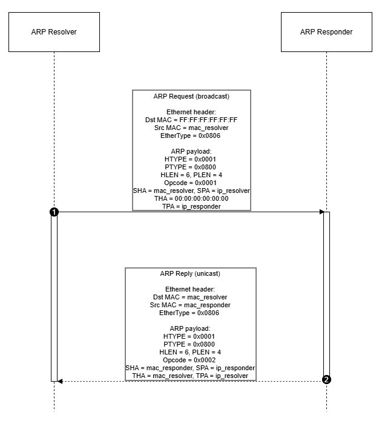 
  <em>Slika 3: UML sekvencijalni dijagram – validan ARP zahtjev (TPA match)</em>

### **2. Filtriranje tuđih zahtjeva i nevažećeg saobraćaja**

Ovaj testni slučaj prikazuje situacije u kojima posmatrani čvor ne smije poslati ARP odgovor.

* **Slučajevi bez odgovora:**
  - **Non-ARP okvir:** `EtherType ≠ 0x0806` (npr. IPv4 okvir gdje je `EtherType = 0x0800`).
  - **Nevažeća ARP poruka:** ARP okvir koji nema ispravne parametre zaglavlja ili nije ARP Request, npr. važi bilo koji od uslova:  
    `HTYPE ≠ 0x0001` **ili** `PTYPE ≠ 0x0800` **ili** `HLEN ≠ 6` **ili** `PLEN ≠ 4` **ili** `Opcode ≠ 0x0001`.
  - **Target IP mismatch:** ARP Request je formalno ispravan, ali ciljni IP (`TPA`) **ne pripada** posmatranom čvoru.
* **Rezultat:** Posmatrani čvor ignoriše okvir i **ne šalje** ARP Reply.

   
  <em>Slika 4: UML sekvencijalni dijagram – Filtriranje tuđih zahtjeva i nevažećeg saobraćaja (non-ARP, nevažeći ARP, TPA mismatch)</em>

> Napomena: Konceptualno postoje dvije grupe testova:  
> **(1) sa odgovorom** – Scenarij 1, i **(2) bez odgovora** – Scenariji 2, 3 i 4, koji predstavljaju različite slučajeve filtriranja/odbacivanja okvira (TPA mismatch, non-ARP EtherType i nevažeći ARP format).

## WaveDrom dijagram
Wavedrom dijagrami su kreirani pomoću WaveDrom alata. Izvorni `.json` fajlovi za sve prikazane scenarije dostupni su u direktoriju [Wavedrom](./Wavedrom).

Dijagrami pokrivaju sljedeće scenarije:

### Scenarij 1: Generisanje ARP odgovora (Target IP Match)

Ovaj scenarij demonstrira nominalni rad ARP Responder modula kada primi ARP Request paket namijenjen upravo njemu. Prikazani dijagram prikazuje kompletan ciklus: od detekcije broadcast zahtjeva do generisanja unicast odgovora.

   
  <em>Slika 5: Wavedrom za uspješnu rezoluciju </em>

* **1. Ulazna faza: Prijem i Identifikacija (RX)**
Proces počinje aktivacijom Avalon-ST Input interfejsa (`in_valid = 1`, `in_sop = 1`). Modul analizira dolazni okvir:
Ethernet Zaglavlje: Detektuje se Broadcast MAC (`FF..FF`), što signalizira da je paket namijenjen svima. `EtherType 0x0806` potvrđuje da je riječ o `ARP protokolu`.
ARP Zaglavlje: `Opcode 00 01` identifikuje ARP Request. Modul privremeno pamti Sender MAC i Sender IP (`192.168.1.100`) kako bi adresirao odgovor.
* **2. Proces**
Automat stanja prolazi kroz sekvencu provjere zaglavlja do stanja `RX_ARP_ADDRS`, gdje se donosi odluka:
Poređenje: Modul čita Target IP (`192.168.1.1`) iz paketa i poredi ga sa svojom lokalnom IP adresom.
Odluka: Budući da je detektovano poklapanje adresa, automat prelazi u stanje `TX_SEND` radi slanja odgovora.
* **3. Izlazna faza: Generisanje Odgovora (TX)**
U stanju `TX_SEND`, modul putem Avalon-ST Output linija generiše odgovor:
Ethernet Odgovor: Paket se šalje kao Unicast. Destination MAC se postavlja na adresu pošiljaoca zahtjeva (`00:11:22...`), a Source MAC na adresu FPGA modula.
ARP Payload: Opcode se mijenja u `00 02` (ARP Reply). U polje Sender IP upisuje se lokalna adresa (`192.168.1.1`), dok se originalni pošiljalac postavlja kao Target.
Kraj: Signal `out_eop` označava kraj prenosa, nakon čega se FSM vraća u IDLE.

### Scenarij 2: Odbacivanje tuđeg zahtjeva (Target IP Mismatch) 

Dijagram prikazuje ponašanje modula kada primi ARP zahtjev koji nije namijenjen ovom uređaju (nepoklapanje IP adrese).

   
  <em>Slika 6: Wavedrom za neuspješnu rezoluciju </em>

* **1. Ulazna faza: Prijem Paketa (RX)**
Modul putem Avalon-ST Input interfejsa uredno prima Broadcast ARP paket.
Automat stanja prolazi kroz standardne faze provjere (`RX_ETH_HDR, RX_ARP_FIELDS`) jer je struktura paketa validna.
Paket se identifikuje kao ARP Request sa pitanjem: "Ko ima IP adresu `192.168.2.50`?"
* **2. Logika Odlučivanja (Mismatch)**
U stanju RX_ARP_ADDRS, vrši se ključna provjera:
Poređenje: Modul čita traženi Target IP (`192.168.2.50`) i poredi ga sa svojom lokalnom IP adresom (`192.168.1.1`).
Detekcija: Logika detektuje da se adrese ne podudaraju. Zahtjev nije namijenjen ovom uređaju.
* **3. Ishod: Odbacivanje (DROP)**
Umjesto prelaska u fazu slanja, dešava se sljedeće:
Stanje: Automat prelazi u stanje `DROP` kako bi prekinuo obradu, a zatim se odmah vraća u `IDLE`.
Izlaz: Avalon-ST Output signali (`out_valid`, `out_sop`) ostaju na nuli. Modul ostaje "tih" i ne šalje odgovor, efikasno filtrirajući nepotreban saobraćaj.

### Scenarij 3: Odbacivanje Non-ARP okvira (pogrešan EtherType)

Ovaj scenarij testira granični slučaj u kojem modul prima Ethernet okvir koji **nije ARP** (npr. IPv4), tj. kada je `EtherType ≠ 0x0806`. Cilj je potvrditi da se okvir odbacuje odmah na Ethernet sloju i da se **ne pokušava** parsiranje ARP polja niti generiše bilo kakav odgovor.

  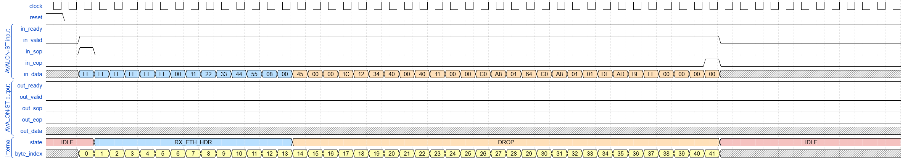 
  <em>Slika 7: Wavedrom za Non-ARP okvir (EtherType = 0x0800) </em>

* **1. Ulazna faza: Prijem i Ethernet identifikacija (RX)** Modul prima Ethernet okvir preko Avalon-ST ulaza (`in_valid = 1`, `in_sop = 1`). Tok bajtova se parsira bajt-po-bajt do polja EtherType:  Na bajtovima 12–13 se očitava `EtherType = 0x0800`, što označava IPv4 okvir (Non-ARP). Time se aktivira indikator `eth_fail`, jer okvir nije relevantan za ARP responder logiku.

* **2. Ishod: Odbacivanje okvira (DROP)** Nakon detekcije `eth_fail`, FSM: prelazi u stanje `DROP` i ignoriše preostale bajtove okvira do `in_eop`, **ne aktivira** izlazne signale (`out_valid` ostaje 0), tj. ne ulazi u `TX_SEND`.

### Scenarij 4: Odbacivanje nevažeće ARP poruke (pogrešan ARP format – HLEN)

Ovaj scenarij testira slučaj u kojem modul prima okvir koji **jeste ARP** (`EtherType = 0x0806`) i čak izgleda kao ARP Request (`Opcode = 0x0001`), ali ARP zaglavlje **nije validno** jer jedno od fiksnih ARP polja ne odgovara standardnom Ethernet/IPv4 formatu. U ovom testu namjerno je postavljeno pogrešno polje **HLEN** (`HLEN ≠ 6`). Cilj je potvrditi da modul odbacuje ovakvu poruku u fazi validacije ARP polja i da **ne generiše** ARP Reply.

  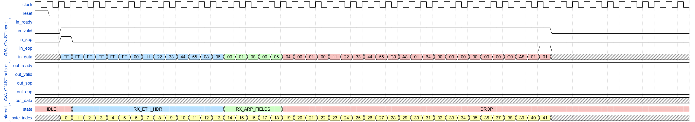 
  <em>Slika 8: Wavedrom za nevažeći ARP okvir (pogrešan HLEN)</em>

* **1. Ulazna faza: Prijem i identifikacija ARP okvira (RX)**  Modul prima Ethernet okvir preko Avalon-ST ulaza (`in_valid = 1`, `in_sop = 1`). Tok bajtova se parsira bajt-po-bajt: Na bajtovima 12–13 očitava se `EtherType = 0x0806`, čime se potvrđuje da je riječ o ARP okviru. U ARP zaglavlju `Opcode = 0x0001` označava ARP Request, ali se tokom provjere fiksnih ARP polja detektuje da je `HLEN` pogrešan (nije 6).

* **2. Ishod: Odbacivanje okvira (DROP)** Nakon detekcije greške u ARP formatu (`arp_fields_fail`), FSM: prelazi u stanje `DROP` i ignoriše preostale bajtove okvira do `in_eop`, **ne aktivira** izlazne signale (`out_valid` ostaje 0), tj. ne ulazi u `TX_SEND`.

## Konačni automat 

Konačni automat (engl. *Finite State Machine – FSM*) predstavlja formalni način modeliranja sekvencijalnih logičkih sklopova, gdje se rad sistema opisuje kroz konačan skup stanja i uslovne prelaze između njih. Takav model može biti veoma koristan pri projektovanju određenih tipova sistema, posebno onih čiji zadaci čine jasno definisan slijed [7]. U praksi se FSM može prikazati na dva komplementarna načina: **dijagramom stanja**, koji grafički predstavlja specifikaciju automata (sva moguća stanja, ulazne uslove prelaza i ponašanje/izlaze u pojedinim stanjima), ili **hardverski baziranom reprezentacijom**, koja naglasak stavlja na RTL implementaciju kroz kombinacionu i sekvencijalnu logiku. Dijagram stanja je posebno koristan jer pojednostavljuje razumijevanje i provjeru dizajna prije same implementacije, dok hardverski prikaz direktno pokazuje kako se automat realizuje u digitalnom kolu. U okviru ovog projekta, FSM je korišten kao kontroler koji parsira ulazni tok podataka kroz više slojeva mrežnog okvira, obuhvatajući identifikaciju početka paketa, validaciju zaglavlja po slojevima i donošenje odluke o daljoj obradi na osnovu sadržaja okvira.

### Princip rada konačnog automata

Modul u stanju mirovanja (**IDLE**) čeka početak novog Ethernet okvira. Početak okvira se na Avalon-ST ulazu detektuje kada su istovremeno aktivni `in_valid=1` i `in_sop=1`. U tom trenutku brojač `byte_index` se resetuje na nulu (`byte_index := 0`) i FSM započinje parsiranje okvira bajt-po-bajt.

Nakon detekcije početka paketa, FSM prvo prelazi u stanje **RX_ETH_HDR** i vrši provjeru Ethernet zaglavlja, odnosno polja EtherType. Ukoliko EtherType nije jednak vrijednosti **0x0806** (ARP), okvir se smatra nerelevantnim za ARP rezoluciju i FSM prelazi u stanje **DROP**, gdje se ne generiše izlazni saobraćaj, već se preostali dio okvira ignoriše do `in_eop=1`.

Ako je EtherType ispravan, FSM nastavlja u stanje **RX_ARP_FIELDS** i validira fiksna ARP polja koja moraju odgovarati standardnom Ethernet/IPv4 ARP Request formatu: `HTYPE=0x0001` (Ethernet), `PTYPE=0x0800` (IPv4), `HLEN=6`, `PLEN=4`, te `OPER=0x0001` (ARP Request). Neuspjeh bilo koje od ovih provjera predstavlja pogrešan format ili poruku koja nije zahtjev, te se okvir odbacuje prelaskom u stanje **DROP** bez odgovora.

Tek kada su i Ethernet i ARP kontrolna polja potvrđena, FSM prelazi u stanje **RX_ARP_ADDRS** i provjerava adrese. U ovoj fazi se posebno provjerava da je `TPA` (Target Protocol Address) jednak konfigurisanom `IP_ADDRESS` modula. Ako se `TPA` ne poklapa (`tpa_mismatch=1`), zahtjev nije namijenjen ovom uređaju i odgovor se ne generiše. Ako se `TPA` poklapa (`tpa_mismatch=0`), FSM zaključuje da je primljen validan ARP Request za IP adresu modula i prelazi u stanje slanja odgovora.

U stanju **TX_SEND** modul formira i šalje **ARP Reply** bajt-po-bajt preko Avalon-ST izlaza. Slanje je kontrolisano signalom `out_ready`: izlaz napreduje samo kada je `out_ready=1`, dok pri `out_ready=0` modul zadržava trenutni izlazni bajt (izlaz ostaje stabilan) i čeka da prijemnik ponovo bude spreman. Pošto se u ovom projektu koristi isti brojač `byte_index` i za prijem i za slanje, na prelazu u **TX_SEND** brojač se resetuje (`byte_index := 0`) i dalje predstavlja indeks izlaznog bajta ARP Reply poruke.

**Upravljanje brojačem `byte_index`:** 
Tokom RX faze (`RX_ETH_HDR`, `RX_ARP_FIELDS`, `RX_ARP_ADDRS`) `byte_index` predstavlja indeks primljenog bajta u okviru i inkrementira se sa svakim validnim primljenim bajtom (parsiranje “bajt-po-bajt”). Brojač se resetuje na početku okvira (detekcija SOP-a) i na prelazu u TX fazu (da bi slanje krenulo od prvog bajta odgovora).

> U okviru testiranja očekuje se da ulazni Ethernet/ARP okvir sadrži sve potrebne bajtove do kraja ARP poruke. Ako se `in_eop=1` pojavi prije nego što FSM dođe do očekivanih polja (preuranjeni EOP), okvir se tretira kao neispravan i odbacuje se (povratak u **IDLE**, bez odgovora). Ako se nakon očekivanog kraja ARP poruke okvir nastavlja (`in_eop` ne dođe na očekivanom kraju), okvir se tretira kao neočekivano produžen i FSM prelazi u **DROP**, gdje se preostali bajtovi ignorišu sve dok `in_eop` ne postane 1. Ovim slučajevima se provjerava da FSM ima determinističko i robusno ponašanje i kada ulazni tok ne prati očekivanu strukturu ARP poruke.

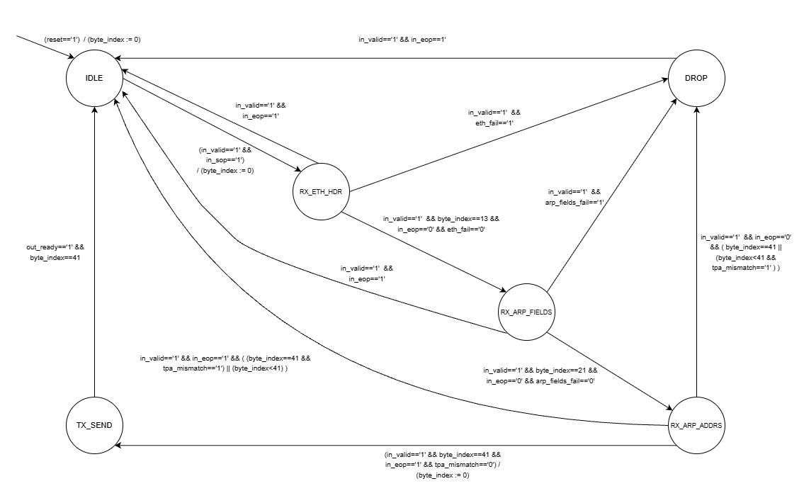 
  <em>Slika 9: Dijagram konačnog automata (FSM) ARP Responder modula.</em>

### Stanja automata
FSM sadrži ukupno 6 stanja (kao na dijagramu):

- **IDLE** – početno stanje; čekanje `in_valid` + `in_sop` (početak okvira)  
- **RX_ETH_HDR** – prijem i validacija Ethernet zaglavlja (provjera EtherType = 0x0806)  
- **RX_ARP_FIELDS** – provjera fiksnih ARP polja (HTYPE/PTYPE/HLEN/PLEN) i opcode (Request)  
- **RX_ARP_ADDRS** – provjera da li je zahtjev za IP respondera (`TPA = IP_ADDRESS`).
- **DROP** – ignorisanje okvira do `in_eop`, bez generisanja odgovora.
- **TX_SEND** – slanje ARP Reply okvira uz poštivanje `out_ready` (kontrolisani tok podataka)

### Grupisane provjere (indikatori greške)
Da bi dijagram ostao pregledan i čitljiv, više provjera koje se realizuju bajt-po-bajt (na tačno određenim pozicijama u okviru) grupisano je u indikatore, umjesto da se na svakoj tranziciji navode pojedinačni uslovi za svaki bajt. Na taj način FSM dijagram zadržava fokus na funkcionalnim fazama obrade, dok se detaljna logika provjera nalazi u RTL implementaciji kroz odgovarajuće poređenje vrijednosti na relevantnim `byte_index` pozicijama.

- **`eth_fail`** – nije ARP (EtherType ≠ 0x0806)  
- **`arp_fields_fail`** – ARP format/opcode nisu očekivani za Ethernet/IPv4 ARP Request  
- **`tpa_mismatch`** – Target IP (TPA) nije IP adresa modula

> Napomena: U okviru ovog projekta padding i CRC polja Ethernet okvira se ne modeliraju, te se pod “krajem okvira” u testnim vektorima podrazumijeva kraj ARP poruke (tj. `in_eop` se očekuje na završetku ARP sadržaja).

## VHDL implementacija

Sklop ARP Responder modula modeliran je u VHDL-u koristeći ranije opisane Avalon-ST signale i FSM stanja. Modul prima Ethernet/ARP okvir, vrši provjere relevantnih polja, te u slučaju validnog ARP Request-a za vlastitu IP adresu generiše ARP Reply.

Implementacija je organizovana kroz tri logičke cjeline:

- **Kombinatorna logika za tranzicije stanja (`next_state`)** – na osnovu trenutnog stanja, ulaznih signala (`in_valid`, `in_sop`, `in_eop`) i indikatora provjera odlučuje prelaz u naredno stanje (`RX_ETH_HDR`, `RX_ARP_FIELDS`, `RX_ARP_ADDRS`, `TX_SEND`, `DROP`).
- **Sekvencijalni proces (register dio)** – na rastućoj ivici takta ažurira trenutno stanje, brojače i pomoćne registre (uključujući pamćenje `req_mac` i `req_ip`).
- **Kombinatorna logika izlaza** – u stanju `TX_SEND` generiše `out_valid`, `out_sop`, `out_eop` i `out_data` (ARP Reply), uz poštivanje `out_ready`.

Za parsiranje okvira koristi se `byte_index` i efektivni indeks `rx_idx`:

- `byte_index` služi za pozicioniranje unutar okvira (tj. da se tačno zna koji bajt Ethernet/ARP zaglavlja se trenutno obrađuje).
- `rx_idx` je poravnani indeks koji tretira SOP bajt kao indeks 0 u istom ciklusu, kako bi provjere po bajtovima bile tačno poravnate na očekivane pozicije.

Nakon kompilacije dizajna u Quartus Prime, provjeren je Compilation Report, čime je potvrđeno da je dizajn uspješno kompajliran.

 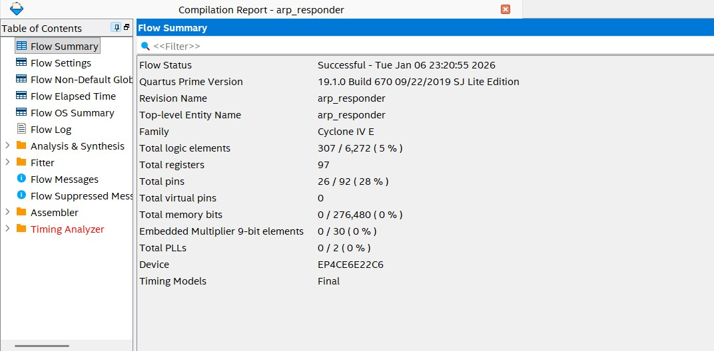 
<em>Slika 10: Prikaz Compilation Report-a nakon uspješne kompilacije dizajna.</em> 

### Verifikacija konačnog automata
FSM implementiran u VHDL-u verifikovan je korištenjem State Machine Viewer alata u okviru Quartus Prime okruženja. Dobijeni grafički prikaz stanja i tranzicija potvrđuje usklađenost implementiranog FSM-a sa prethodno definisanim dijagramom.

 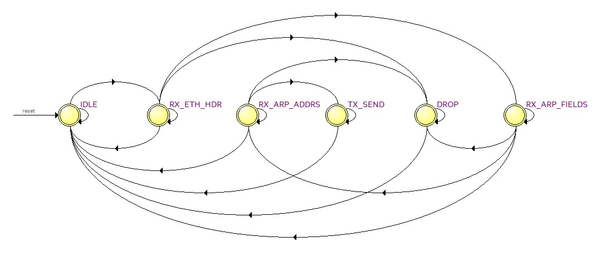 
<em>Slika 11: Verifikacija konačnog automata pomoću Quartus State Machine Viewer-a.</em> 

## Verifikacija pomoću simulacijskog alata ModelSim

Verifikacija je izvršena kroz četiri testna slučaja, organizovana u dvije grupe: test sa generisanjem odgovora i testovi bez odgovora. U svim slučajevima koristi se **Avalon-ST ready/valid** protokol i Ethernet/ARP okvir fiksne dužine **42 bajta** (14 bajta Ethernet + 28 bajta ARP).

Ciljevi verifikacije su:
1. potvrditi korektno parsiranje ARP zahtjeva,
2. potvrditi da se ARP odgovor generiše **samo** kada je zahtjev namijenjen DUT-u (TPA match),
3. potvrditi ispravno ponašanje kontrole toka preko `valid/ready` signala.

### Ready/Valid handshake i kontrola toka (Avalon-ST)

U svim testnim slučajevima poštuje se standardni handshake mehanizam:

- **Ulaz (in_*)**: bajt se prenosi isključivo kada su `in_valid='1'` i `in_ready='1'`.  

- **Izlaz (out_*)**: bajt se smatra prihvaćenim isključivo kada su `out_valid='1'` i `out_ready='1'`.  
  Ako `out_ready='0'` dok je `out_valid='1'`, DUT mora **zadržati stabilne** `out_data/out_sop/out_eop` i držati `out_valid='1'` sve dok `out_ready` ponovo ne postane `'1'`.

## Scenarij 1 — Target IP match (generisanje ARP Reply)

U ovom scenariju simulacijski izvor šalje **ARP Request** broadcast okvirom, gdje se *Target Protocol Address (TPA)* poklapa sa `IP_ADDRESS` DUT-a (npr. `192.168.1.1`). Očekuje se da DUT:
- validira EtherType i ARP polja,
- prepozna TPA match,
- generiše **ARP Reply** (42 bajta) i pošalje ga preko Avalon-ST izlaza.

### Kontrola toka na izlazu (out_ready)
Tokom slanja odgovora, `out_ready` se privremeno spušta na `'0'` tokom nekoliko taktova kako bi se simuliralo da prijemna strana **trenutno nije spremna** da primi bajt. U tom periodu DUT mora:
- zadržati aktivan `out_valid`,
- držati stabilne `out_data/out_sop/out_eop`,
- napredovati na sljedeći bajt isključivo kada ponovo nastupi handshake: `out_valid='1' AND out_ready='1'`.

### Provjera (checker)
Checker provjerava:
1. da je izlazni okvir identičan očekivanom `arp_reply_exp`,
2. da je `out_sop='1'` samo na bajtu 0 i `out_eop='1'` samo na bajtu 41,
3. da su izlazni signali stabilni dok je `out_ready='0'` (HOLD ponašanje),
4. da se brojač očekivanog bajta povećava samo na handshake.

   
  <em>Slika 12: ModelSim waveform (0–500 ns) — prijem ARP Request okvira i početak obrade (Scenarij 1).</em>

   
  <em>Slika 13: ModelSim waveform (500–1000 ns) — slanje ARP Reply okvira i provjera kontrole toka preko out_ready (Scenarij 1).</em>

   
  <em>Slika 14: ModelSim transcript — nema prijavljenih grešaka tokom provjera (Scenarij 1).</em>

  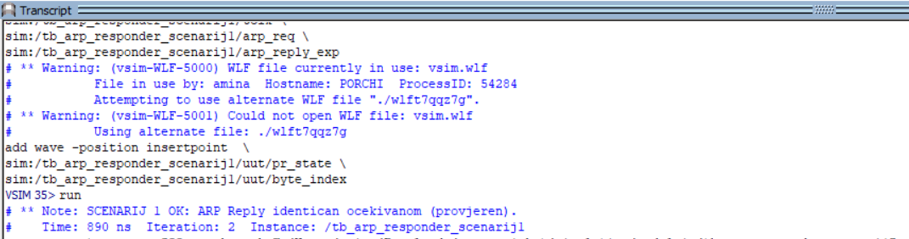 
  <em>Slika 15: ModelSim transcript — završna poruka checkera za Scenarij 1 (test uspješno prošao).</em>

## Scenarij 2 — Target IP mismatch (ignorisan ARP Request)

U ovom scenariju simulacijski izvor šalje **ARP Request** gdje je *Target Protocol Address (TPA)* različit od `IP_ADDRESS` DUT-a (npr. `192.168.2.50` umjesto `192.168.1.1`). Očekuje se da DUT:
- detektuje `TPA mismatch`,
- **ne generiše ARP Reply**,
- ne ulazi u TX fazu (tj. `out_valid` mora ostati `'0'`).

### Provjera (checker)
Checker verifikuje da se `out_valid` ne aktivira:
- tokom prijema okvira,
- kao ni u dodatnom vremenskom prozoru nakon završetka prijema (nakon EOP na ulazu).

  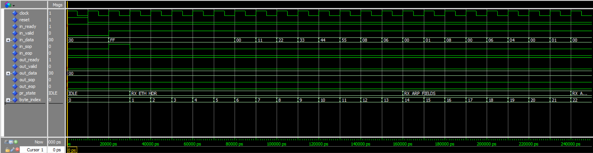 
  <em>Slika 16: ModelSim waveform (0–250 ns) — prijem ARP Request okvira sa TPA mismatch (Scenarij 2).</em>

   
  <em>Slika 17: ModelSim waveform (250–500 ns) — potvrda da ne dolazi do TX faze (out_valid ostaje 0) (Scenarij 2).</em>

   
  <em>Slika 18: ModelSim transcript — nema prijavljenih grešaka tokom provjera (Scenarij 2).</em>

   
  <em>Slika 19: ModelSim transcript — završna poruka checkera za Scenarij 2 (DUT nije generisao ARP Reply).</em>

## Scenarij 3 — Non-ARP okvir (pogrešan EtherType, odbacivanje na Ethernet sloju)

U ovom scenariju simulacijski izvor šalje Ethernet okvir fiksne dužine **42 bajta**, ali sa **EtherType ≠ 0x0806** (npr. `0x0800` – IPv4). Time se testira ponašanje DUT-a u slučaju kada okvir **nije ARP**, tj. kada već na Ethernet sloju mora biti prepoznat kao nerelevantan za ARP proces.

Očekuje se da DUT:
- detektuje pogrešan EtherType (`eth_fail`),
- pređe u režim odbacivanja okvira (DROP) i ignoriše bajtove do `in_eop`,
- **ne generiše ARP Reply** i ne ulazi u TX fazu (`out_valid` mora ostati `'0'`).

> Napomena: Iako ostatak payload-a nije ARP, okvir je zadržan na **42 bajta** radi konzistentnosti sa testbench logikom i kako bi se verifikacija fokusirala na ključnu odluku DUT-a: odbacivanje okvira na osnovu EtherType polja.

### Provjera (checker)
Checker verifikuje da se `out_valid` ne aktivira:
- tokom prijema cijelog okvira sa EtherType `0x0800`,
- kao ni u dodatnom vremenskom prozoru nakon završetka prijema (nakon EOP na ulazu), što potvrđuje da DUT ne pokušava slati odgovor na non-ARP saobraćaj.

  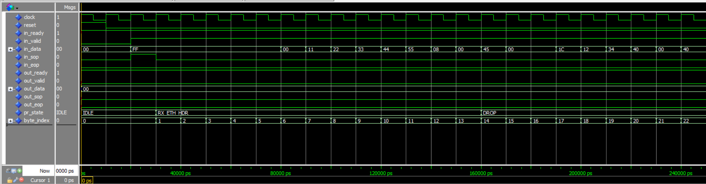 
  <em>Slika 20: ModelSim waveform (0–250 ns) — prijem Ethernet okvira sa EtherType=0x0800 (Non-ARP) i početak odbacivanja (Scenarij 3).</em>

   
  <em>Slika 21: ModelSim waveform (250–500 ns) — potvrda da ne dolazi do TX faze (out_valid ostaje 0) (Scenarij 3).</em>

  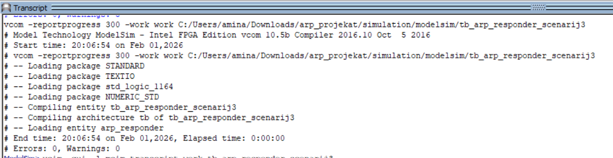 
  <em>Slika 22: ModelSim transcript — nema prijavljenih grešaka tokom provjera (Scenarij 3).</em>

   
  <em>Slika 23: ModelSim transcript — završna poruka checkera za Scenarij 3 (DUT ispravno nije generisao ARP Reply).</em>

## Scenarij 4 — Nevažeći ARP format (pogrešan HLEN, odbacivanje na ARP sloju)

U ovom scenariju simulacijski izvor šalje **ARP Request** Ethernet okvirom fiksne dužine **42 bajta** (14 bajtova Ethernet + 28 bajtova ARP), pri čemu su `EtherType = 0x0806` i `Opcode = 0x0001` ispravni. Međutim, ARP zaglavlje je namjerno napravljeno **nevažećim** tako što je polje **HLEN** postavljeno na pogrešnu vrijednost (`HLEN ≠ 6`). Time se testira da DUT ne odgovara na ARP poruke koje nisu u standardnom Ethernet/IPv4 ARP formatu.

Očekuje se da DUT:
- prepozna da je okvir ARP (`EtherType = 0x0806`),
- u fazi provjere fiksnih ARP polja detektuje grešku (`arp_fields_fail`) zbog pogrešnog `HLEN`,
- pređe u režim odbacivanja okvira (DROP) i ignoriše bajtove do `in_eop`,
- **ne generiše ARP Reply** i ne ulazi u TX fazu (`out_valid` mora ostati `'0'`).

### Provjera (checker)
Checker verifikuje da se `out_valid` ne aktivira:
- tokom prijema cijelog ARP okvira sa pogrešnim `HLEN`,
- kao ni u dodatnom vremenskom prozoru nakon završetka prijema (nakon EOP na ulazu), što potvrđuje da DUT ne pokušava slati odgovor na formalno neispravnu ARP poruku.

   
  <em>Slika 24: ModelSim waveform (0–250 ns) — prijem ARP Request okvira sa nevažećim HLEN (Scenarij 4).</em>

   
  <em>Slika 25: ModelSim waveform (250–500 ns) — potvrda da ne dolazi do TX faze (out_valid ostaje 0) (Scenarij 4).</em>

  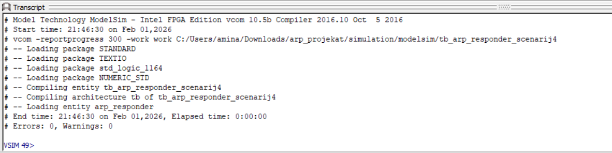 
  <em>Slika 26: ModelSim transcript — nema prijavljenih grešaka tokom provjera (Scenarij 4).</em>

   
  <em>Slika 27: ModelSim transcript — završna poruka checkera za Scenarij 4 (DUT ispravno nije generisao ARP Reply).</em>

## Zaključak

U okviru ovog projekta implementiran je ARP Responder modul u VHDL-u koji prima Ethernet okvire preko Avalon-ST interfejsa, parsira ARP sadržaj bajt-po-bajt i generiše ARP Reply isključivo kada su ispunjeni svi uslovi validnosti (EtherType = 0x0806, ispravan Ethernet/IPv4 ARP Request format i poklapanje ciljne IP adrese sa `IP_ADDRESS`). Kontrola toka je realizovana korištenjem ready/valid handshake mehanizma, pri čemu je posebno verifikovano ispravno “HOLD” ponašanje na izlazu tokom `out_ready='0'` u fazi slanja odgovora.

Funkcionalna ispravnost potvrđena je simulacijom u ModelSim-u kroz više testnih slučajeva: (1) nominalni slučaj sa generisanjem ARP Reply okvira (TPA match) i (2) grupa scenarija bez odgovora, gdje DUT pravilno odbacuje ili ignoriše okvire koji nisu namijenjeni njemu ili nisu validni (TPA mismatch, non-ARP EtherType, nevažeći ARP format – npr. pogrešan HLEN). Dodatno, ponašanje i sekvenca obrade su dokumentovani kroz WaveDrom dijagrame i FSM prikaz, čime je obezbijeđena jasna veza između specifikacije, RTL implementacije i rezultata verifikacije.

## Budući rad (moguća unapređenja)

U narednoj fazi, projekat se može proširiti i ojačati kroz sljedeće nadogradnje:

- **Šira podrška ARP tipovima poruka:** Dodati podršku za obradu drugih ARP poruka (npr. ARP Reply ulazno, ili specifične varijante) ili eksplicitno filtriranje/odbijanje prema dodatnim pravilima.
- **ARP cache / tabela preslikavanja:** Implementirati jednostavnu ARP tabelu (cache) koja bi pamtila parove `(SPA, SHA)` iz validnih ARP okvira, što bi omogućilo naprednije ponašanje i dodatnu validaciju saobraćaja.
- **Robusnija validacija okvira:** Proširiti provjere na dodatne detalje, npr. minimalnu/realnu dužinu Ethernet okvira, detekciju preuranjenog `in_eop`, te eksplicitno rukovanje neočekivano produženim okvirima (pored postojećeg `DROP` mehanizma).
- **Podrška za padding i CRC (modeliranje):** Iako projekat trenutno ne modelira CRC i padding, budući rad može uključiti barem modeliranje prisustva padding-a, te (opcionalno) CRC polja radi približavanja realnom Ethernet okruženju.
- **Parametrizacija i konfigurabilnost:** Omogućiti konfiguraciju dodatnih parametara (npr. dozvoljeni opseg IP adresa, filtriranje po sender IP/MAC, ili mogućnost odgovora samo na određene MAC destinacije).
- **Integracija u širi sistem:** Testirati modul u okviru većeg FPGA dizajna (npr. zajedno sa MAC/PHY ili mrežnim stack-om), te provesti validaciju kroz hardversko testiranje i stvarni mrežni saobraćaj (npr. generisanje ARP zahtjeva sa računara i posmatranje odgovora).

## Literatura

[1] D. C. Plummer, “An Ethernet Address Resolution Protocol: Or Converting Network Protocol Addresses to 48-bit Ethernet Address for Transmission on Ethernet Hardware,” RFC 826, Nov. 1982. [Na internetu]. Dostupno: https://www.rfc-editor.org/rfc/rfc826.html [pristupljeno 01.02.2026.].

[2] C. E. Spurgeon i J. Zimmerman, *Ethernet: The Definitive Guide: Designing and Managing Local Area Networks*, 2. izd. Sebastopol, CA, SAD: O’Reilly Media, 2014.

[3] IPCisco, “Address Resolution Protocol (ARP),” [Na internetu]. Dostupno: https://ipcisco.com/lesson/address-resolution-protocol-arp/ [pristupljeno 01.02.2026.].

[4] Fortinet, “What is ARP?,” [Na internetu]. Dostupno: https://www.fortinet.com/resources/cyberglossary/what-is-arp [pristupljeno 01.02.2026.].

[5] Intel, “Avalon® Interface Specifications,” ver. 22.3, Sep. 2025. [Na internetu]. Dostupno: https://www.intel.com/content/www/us/en/docs/programmable/683091/22-3/introduction-to-the-interface-specifications.html [pristupljeno 01.02.2026.].

[6] K. Blažeka, “Address Resolution Protocol (ARP),” [Na internetu]. Dostupno: http://kristinka-blazeka-blog.from.hr/?page_id=913 [pristupljeno 01.02.2026.].

[7] V. A. Pedroni, *Circuit Design and Simulation with VHDL*. Cambridge, MA, SAD: The MIT Press, 2004.

